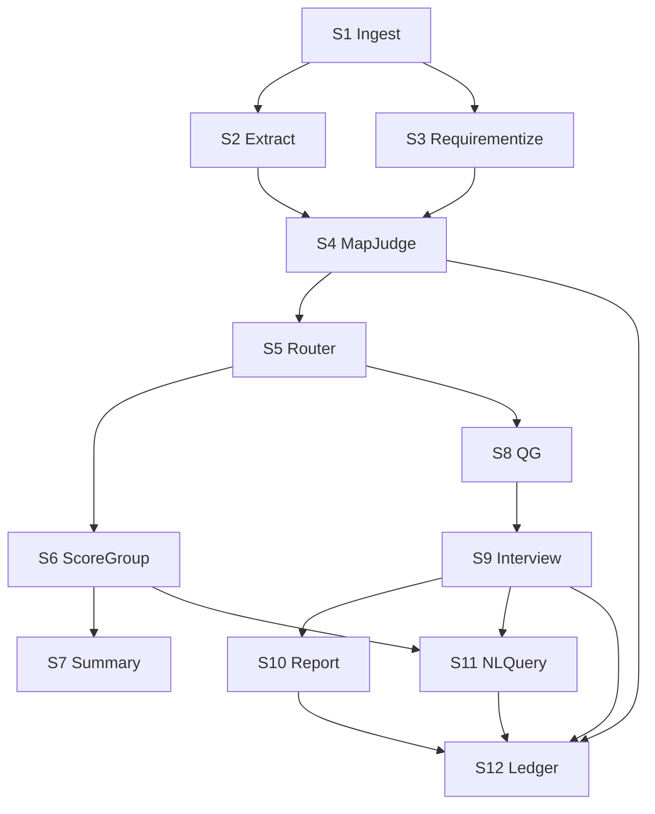
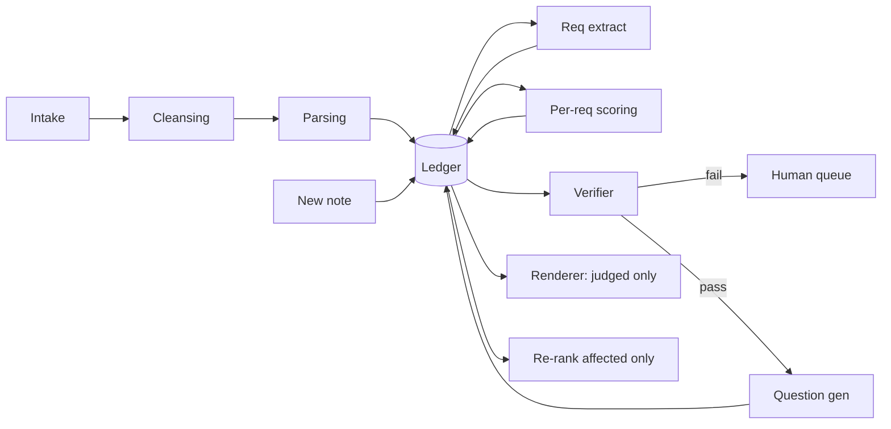
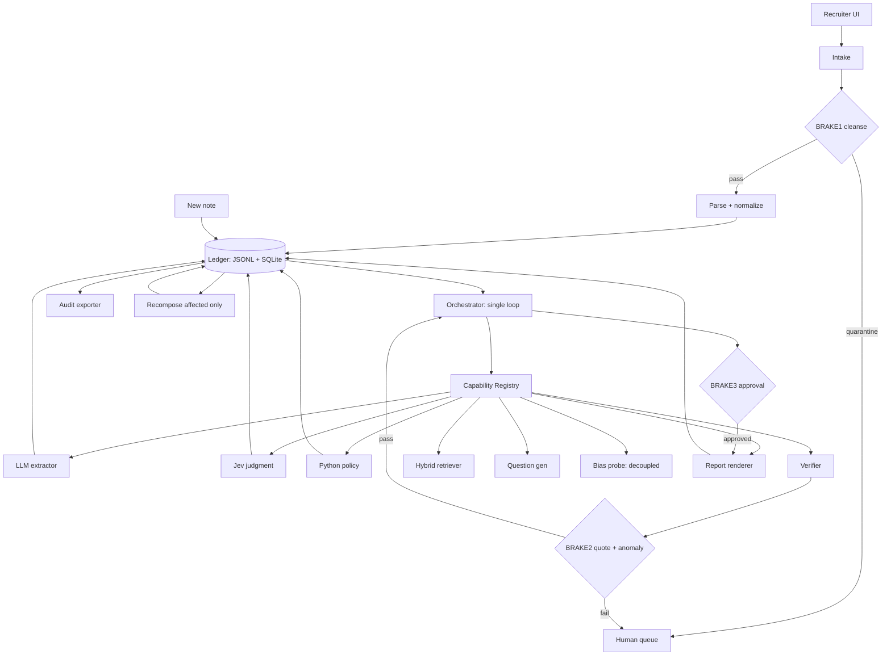

# HireFlow — Complete Buildable System Architecture
**Decision-ready package (not a landscape survey) | 2026-09-19 | Status: Recommended architecture + MVP frozen for build**

> Evidence base: `output/Hireflow/hireflow_research.md` (24 products, 24 papers, 24 GitHub, 8-10 regulatory sources, §§1-18 + Jev/Sales-RL addendum, ~125 sources) + `output/Hireflow/MASTER.md` (living source of truth, 66 sections, provisional Primary Agent + hybrid LLM/Jev/Python + evidence graph + MVP §§44-48).
> Method: `architecture-designer` (requirements → patterns → trade-offs → ADRs → risks). Parallel drafting via 4 specialist sections, integrated here.
> Tags (every claim): **[MANDATORY]** = brief/law requires · **[RESEARCH-IMPLIED]** = research forces · **[OUR CHOICE]** = engineering decision · **[INNOVATION]** = beyond baseline with cost/benefit. Quality: Source-derived fact / Researcher inference / Our proposed design / Speculation.
> This report is engineering synthesis, **not legal advice**.

---

## 1. Executive summary (<200 words)

**Recommendation: build the Judged Ledger Loop — a single Primary Agent loop over an append-only evidence ledger, where typed classifier judgments (Jev, feature-flagged) + deterministic Python policy decide per-requirement states, verifiers enforce brakes, and the LLM narrates only verified spans.** Reuse mature parsing/retrieval/LLM blocks; differentiate on connective tissue: numbered requirements → graded evidence → uncertainty vocabulary → gap-conditioned questions → cited NL queries → JSON+PDF audit export. MVP covers all 14 mandatory capabilities minimally plus 4 differentiators (ledger, graded evidence, gap-conditioned QG, zero-token re-score + cleansing demo) in 48h on <$50 with local-first SQLite+FAISS, FastAPI, Vite+Tailwind, Gemini-flash + fallback, custom orchestrator. Human decides every hire; no external write without explicit approval; single EU-strict mode. Demo: JD+12 resumes → per-requirement evidence boxes → gap question → interview-note re-eval diff → NL query → policy-edit instant re-score → poisoned-resume block → audit pack. Fallback for every external dependency is defined.

---

## 2. Requirements, constraints, MASTER comparison

### 2.1 Conflict rule
Research §1 prose and MASTER §1.1 numbered list describe the same 14 capabilities **[MANDATORY | Source-derived fact]**. **MASTER §1.1 wins where they differ** — research §§16-18 are explicitly non-normative findings; MASTER §§44/61/64 is the build contract **[MANDATORY | Source-derived fact]**.

### 2.2 The 14 mandatory capabilities
R1 JD+resume ingestion · R2 skill/exp/project/qualification extraction · R3 candidate→requirement mapping (per-requirement) · R4 missing/unclear detection · R5 grouping (evidence cohorts) · R6 structured summaries (evidence vs inference split) · R7 candidate-specific questions · R8 follow-ups gated on prior answer · R9 note summarization · R10 interview evidence→requirement mapping · R11 unanswered areas · R12 standardized reports from assessed findings only · R13 NL pool queries with provenance · R14 audit trail per insight + version + approver — all **[MANDATORY | Source-derived fact]** (MASTER §1.1; research §1).

### 2.3 Constraints (filled — were blank in prompt §1.3)
| Constraint | Value | Tag |
|---|---|---|
| Build window | 48 hours | [OUR CHOICE] Assumption, matches research §17 + MASTER §45 |
| Team | 3-4: frontend, backend, ML/LLM, floater/QA | [OUR CHOICE] Our proposed design |
| LLM/API budget | Free tiers + <$50; no fine-tuning | [OUR CHOICE] Our proposed design |
| Deployment | Local demo primary + Vercel + Cloud Run backup | [OUR CHOICE] Our proposed design |
| Demo | 3-min live + Q&A, MASTER §46 golden path, cached fixtures | [OUR CHOICE] Researcher inference |
| Data | Synthetic/anonymized only, declared non-representative | [OUR CHOICE] Researcher inference, research §§8/17 |
| Hard rules | Human decides every hire; no external write without explicit approval; ADM OFF; no emotion/face/deception inference; no auto-reject | [MANDATORY] MASTER §§12/27/36/61; research §8 Art.5/22 |
| Judging | Balanced innovation/feasibility/explainability/compliance | [OUR CHOICE] Speculation |

### 2.4 MASTER.md comparison — what we kept / changed / froze
**Kept:** Primary Agent goal/plan/delegate/re-plan/escalate loop (MASTER §§5/11); hybrid LLM→extract / Jev→judge / Python→policy / evidence→justify / agent→next-action (§§17/18/40C); evidence graph → append-only ledger (§§23/30); policy engine with benchmark-owned thresholds (§54); golden path + 3-min structure + reliability via cached bundle (§§46-48); non-goals list (§61); 14 success criteria (§62). **[Source-derived fact]**.

**Changed/frozen (MASTER left OPEN/PROVISIONAL, we decide):**
- Framework OPEN (§39/§59 Q1) → **custom minimal orchestrator (~150 lines) with LangGraph patterns; ADK deferred** — ADK overhead unjustified for 48h; registry seam allows later migration. [OUR CHOICE]
- DB OPEN (§58) → **SQLite WAL+JSON+FTS5 + FAISS-local MVP; Postgres+pgvector is research-ideal later** — zero-ops + one-file-per-run beats scale we don't need. [OUR CHOICE]
- LLM OPEN (§58) → **Gemini-flash default via LiteLLM + OpenRouter fallback; temp 0 extract/narrate, 0.3 QG** — swappable, cheap. [OUR CHOICE]
- Screening PROVISIONAL Jev-primary (§58) → **Jev feature-flagged primary with identical-schema LLM structured-output fallback; freeze only after benchmark Actions 1-3** — vendor claims unverified, must not hard-depend. [OUR CHOICE]
- Thresholds (0.75/0.50 in addendum/repo) → **provisional, must log needs-review rate not accuracy; benchmark mandate before production truth** (MASTER §54). [MANDATORY]
- Retrieval (§41 sketch) → **concrete hybrid BM25(FTS5)+dense(bge-small/all-MiniLM)→RRF→cross-encoder, sentence spans + paragraph context**. [OUR CHOICE]
- Grouping OPEN (§24/§59 Q14) → **evidence-shaped cohort object with predicate+similarity+batch-pack action; reject stage-only grouping**. [OUR CHOICE]
- All 24 MASTER §59 open questions → **mapped to decisions in §4 + DQ resolutions below** (residual eval-only items documented, not live).
- Sales-RL trajectory (addendum B) → **Future work; log pattern only as descriptive progression metric, never reuse sales PPO weights**. [OUR CHOICE]

---

## 3. DQ1 — Capability decomposition + dependency graph

Merge R7+R8 (one QG loop) and R9+R10 (one interview pass) — same inputs/state **[OUR CHOICE | Our proposed design]**. 14 capabilities → 12 subproblems, scope preserved.

| Sub | Covers | Engine |
|---|---|---|
| S1 Ingest+Cleanse | R1 | Parser + cleanser [RESEARCH-IMPLIED] research §§11.1/12 |
| S2 Extract profile | R2 | LLM + SkillNER/ONNX + ESCO slice [RESEARCH-IMPLIED] §§5.3/6.4 |
| S3 Requirementize JD→REQ-01..N+weights | R3 pre | LLM structurer + policy-as-data [OUR CHOICE] MASTER §15 |
| S4 Map+Judge per (cand,req)→p+conf | R3 | Classifier + PolicyEngine [RESEARCH-IMPLIED] |
| S5 Uncertainty router (0.35-0.65 band) | R4/R11 | Python [OUR CHOICE] addendum A |
| S6 Score+Group (Python only) | R5 | No LLM score [RESEARCH-IMPLIED] §6.4#4 |
| S7 Summarize (refuse-if-missing) | R6 | LLM + citation forcing [RESEARCH-IMPLIED] §11.5 |
| S8 QG loop (gap→Q→answer→gate) | R7/R8 | LLM QG + Jev gate [RESEARCH-IMPLIED] |
| S9 Interview intel | R9/R10 | LLM claims + Jev contradiction [RESEARCH-IMPLIED] |
| S10 Report (assessed only) | R12 | Deterministic renderer [OUR CHOICE] |
| S11 NL query | R13 | Planner + hybrid retriever [RESEARCH-IMPLIED] §11.2 |
| S12 Audit/export (substrate) | R14+all | Ledger/RunStore [MANDATORY] |

Invariants: Ledger = only write path; PolicyEngine = only scorer; Retriever = only pool reader **[OUR CHOICE | Our proposed design]** (closes research §16 gap #1).

```
[S1 Ingest]--JD--> [S3 Requirementize REQ-01..N] --\
     \--Resume--> [S2 Extract profile] ------------> [S4 Map+Judge] -> [S5 Router 0.35-0.65]
     SUPPORTED/NEEDS_REVIEW/NOT_SUPPORTED -> [S6 Score+Group, Python only]
     -> [S7 Summarize] + [S8 QG gap->Q->answer->gate] -> [S9 Interview intel]
     -> [S10 Report] + [S11 NL query] -> [S12 Audit/export]
     S12 parallel substrate: every arrow = ledger append [RESEARCH-IMPLIED]
```



Build order: S1→S2→S3→S4→S5→S12-skeleton→S6→S7→S8→S9→S10→S11→S12-export **[OUR CHOICE]**.

---

## 4. Resolved open questions (research §18, all ten)

| # | Open question | Decision | Why | Rejected alternative | Accepted risk |
|---|---|---|---|---|---|
| 1 | Jurisdiction posture? | EU-strict globally, no toggle for MVP [OUR CHOICE] | Global employers prefer single strict mode (§18 Q1 note); EU high-risk + Art.14/26 + ≥6mo logs strictest (§8.1); one path fits 48h (§17) | EU/UK/US/India toggle (correct long-term; §8.2 DUAA) | Over-disclosure outside EU; UK/India nuance in DPIA stub |
| 2 | Where does approval gate? | Explicit for rank/question/report/message/shortlist/policy; pre-approve for note summary; read-only else [OUR CHOICE] | Art.22 solely-automated ban (§8.1); ICO rubber-stamp findings (§8.2); mock external writes (§17) | Pre-approve-all (fails Art.14; SHRM 71% problem §12.2) | More clicks; mitigated by cached approvals |
| 3 | Evidence + consent scope? | MVP synthetic resume+notes only; external stubbed CONSENT_REQUIRED [OUR CHOICE] | GDPR pool-consent vs LI + 6-12mo purge (§8.1); IL/MD/CO/India clocks (§§8.3-8.4) | Live GitHub/LinkedIn ingest | Narrower sourcing story; avoids consent bugs |
| 4 | Uncertainty representation? | Graded unanswered/conflicting/unverifiable/stale [RESEARCH-IMPLIED] | Binary insufficient (§16#3); drives QG + confidence | Binary present/missing | Extra UI vocabulary in 3 min |
| 5 | Retrieval granularity? | Sentence spans + paragraph context [OUR CHOICE] | Precision vs context trade-off needs 10-20 doc eval (§18 Q5); hybrid robust (§11.2); verbatim forcing (§11.5) | Page chunks / pure vector | Eval deferred; sentence choice provisional |
| 6 | LLM vs deterministic split? | LLM/Jev per-dimension → Python composite; prose only on judged evidence, refuse if missing [RESEARCH-IMPLIED] | Prevents hallucinated tiers (§6.4/§11.5); Jev can't generate (addendum A); sycophancy (§12.1) | LLM end-to-end ranking | Two-model plumbing; fork cv-screen patterns |
| 7 | Grouping? | Evidence-shaped cohorts + similarity object (§8); reject stage-only [OUR CHOICE] | Stage grouping underserved; cohorts enable batch follow-up (§16) | Score-bucket/stage grouping | Threshold 0.80 untuned |
| 8 | Agent topology? | Single Primary loop with brakes; Interview only subagent candidate [OUR CHOICE] | Multi ~15× tokens (§11.4 QJC); Yuksel is research; MASTER tool-vs-agent rule | 5-agent swarm | Less theatre; claim rests on plan→gap→replan loop (§15) |
| 9 | Disclosure surface? | Pre-apply badge + pre-interview notice + report badge + per-decision explanation + contest path [RESEARCH-IMPLIED] | 79% want to know, 38% walked away (§4.2); right-time transparency (§8.2); NYC/CO/IL notices (§8.3) | On-request-only | More UI chrome |
| 10 | Minimal audit artifact? | source→artifact→span{quote+loc+conf}→claim→assessment + versions + approver; JSON primary + PDF duplicate [MANDATORY] | Brief demands per-insight trail; no product documents full loop (§16#1); Sourcerer/WorkProof closest (§6); ACM sufficiency (§5.7) | ATS logs only | JSON+PDF parity; version growth (bounded synthetic) |

---

## 5. DQ2 — Evidence ledger (central primitive)

**ADR-001: single append-only ledger [OUR CHOICE | Our proposed design]**, pattern from Sourcerer/WorkProof/ACM audit **[RESEARCH-IMPLIED | Source-derived fact]** §§5.7/6.4. No UPDATE/DELETE; correction = `supersedes_id`; `event_hash=sha256(canonical+prev_hash)`; re-render keeps `prev_version_id` + `version_diff{added,changed,retracted}` **[INNOVATION]**.

Chain: SourceRecord → Artifact → EvidenceSpan(quote+loc+conf) → Claim → Assessment → Report/Answer + RunVersion + ApproverLog **[RESEARCH-IMPLIED]**.

```json
{"$id":"hireflow/SourceRecord","required":["id","run_id","kind","filename","mime","sha256","bytes","consent_tier","created_at"],"properties":{"id":{"type":"string"},"run_id":{"type":"string"},"kind":{"enum":["jd","resume","transcript","notes"]},"filename":{"type":"string"},"mime":{"type":"string"},"sha256":{"type":"string"},"bytes":{"type":"integer"},"consent_tier":{"enum":["L0_application","L1_pool"]},"retention_until":{"type":"string","format":"date"},"created_at":{"type":"string","format":"date-time"}}}
{"$id":"hireflow/Artifact","required":["id","source_id","run_id","parser","clean_text_ref","cleanse"],"properties":{"id":{"type":"string"},"source_id":{"type":"string"},"run_id":{"type":"string"},"parser":{"enum":["mineru","pymupdf","tesseract_ocr"]},"parser_version":{"type":"string"},"clean_text_ref":{"type":"string"},"cleanse":{"type":"object","required":["phantom_flag","verdict"],"properties":{"phantom_flag":{"type":"boolean"},"ink_ratio":{"type":"number"},"rendered_vs_extracted_delta":{"type":"number"},"verdict":{"enum":["clean","suspect","blocked"]}}},"event_hash":{"type":"string"}}}
{"$id":"hireflow/EvidenceSpan","required":["id","artifact_id","candidate_id","quote","loc","confidence","verified"],"properties":{"id":{"type":"string"},"artifact_id":{"type":"string"},"candidate_id":{"type":"string"},"quote":{"type":"string","minLength":8,"maxLength":600},"loc":{"type":"object","required":["page","line_start","line_end","char_start","char_end"]},"granularity":{"enum":["sentence","paragraph"]},"confidence":{"type":"number"},"verified":{"type":"object","required":["method","ratio","pass"],"properties":{"method":{"enum":["verbatim","fuzzy_ratio"]},"ratio":{"type":"number"},"pass":{"type":"boolean"}}},"supersedes_id":{"type":["string","null"]}}}
{"$id":"hireflow/Claim","required":["id","candidate_id","text","span_ids"],"properties":{"id":{"type":"string"},"candidate_id":{"type":"string"},"text":{"type":"string","maxLength":280},"span_ids":{"type":"array","minItems":1},"polarity":{"enum":["asserts","denies"]},"extractor":{"type":"string"},"supersedes_id":{"type":["string","null"]}}}
{"$id":"hireflow/Assessment","required":["id","candidate_id","requirement_id","grade","p","confidence","claim_ids","policy_hash","judge"],"properties":{"id":{"type":"string"},"candidate_id":{"type":"string"},"requirement_id":{"type":"string"},"grade":{"enum":["supporting","neutral","conflicting","missing"]},"uncertainty":{"enum":["none","unanswered","conflicting","unverifiable","stale",null]},"p":{"type":"number"},"confidence":{"type":"number"},"claim_ids":{"type":"array"},"policy_hash":{"type":"string"},"judge":{"type":"object"},"supersedes_id":{"type":["string","null"]}}}
{"$id":"hireflow/ReportAnswer","required":["id","kind","candidate_ids","assessment_ids","body_md","version"],"properties":{"id":{"type":"string"},"kind":{"enum":["summary","evaluation_report","nl_answer","question_set"]},"candidate_ids":{"type":"array"},"assessment_ids":{"type":"array","minItems":1},"body_md":{"type":"string"},"version":{"type":"integer"},"prev_version_id":{"type":["string","null"]},"version_diff":{"type":"object"}}}
{"$id":"hireflow/RunVersion","required":["run_id","code_sha","policy_hash","models"],"properties":{"run_id":{"type":"string"},"code_sha":{"type":"string"},"policy_hash":{"type":"string"},"policy_version":{"type":"string"},"models":{"type":"object"}}}
{"$id":"hireflow/ApproverLog","required":["id","run_id","actor","action","target_ids"],"properties":{"id":{"type":"string"},"run_id":{"type":"string"},"actor":{"type":"string"},"action":{"enum":["approve","override","reject","request_revalidation","final_hire_decision"]},"target_ids":{"type":"array"},"rationale":{"type":"string"},"time_on_evidence_s":{"type":"integer"}}}
```

**ADR-002 storage: SQLite WAL+JSON+FTS5 now, Postgres+pgvector ideal later [OUR CHOICE]**. SQLite = zero-ops, one file/run, FTS5≈BM25; `sqlite-vec` optional ANN. Postgres correct at scale (research §11.2) but exceeds 48h. FAISS-rebuilt-per-run rejected (stale) **[RESEARCH-IMPLIED]**. Shared `append/resolve/supersede/export` interface so swap = env flag **[OUR CHOICE]**.

One path: CapabilityExecutor→validate_claim→ledger.append; resolve(cand,req)→latest Assessment; report.render refuses if missing/unverified; new evidence supersedes only affected Assessments + bumps report version **[INNOVATION]**.

---

## 6. DQ3 — Agent topology

| Dim | A Single+brakes | B Deterministic graph | C Planner→Registry→Exec→Verifier | D Multi-agent | E Supervisor-worker |
|---|---|---|---|---|---|
| Tokens (chat 1×, single ~4×, multi ~15× §§11.4/15) | ~4× | ~1-2× | ~4-6× | ~15× [RESEARCH-IMPLIED] | ~10-15× |
| Failure surface (XPIA §12) | Small | Smallest | Small+verifier | Large | Largest |
| Demo 3-min | High | Highest but not agentic | High, plan visible | Low | Lowest |
| Agentic (goal/plan/tool/mem/val/gate/adapt §15) | partial | mostly ✗ | all ✓ | all ✓+redundant | all ✓+unneeded |

**ADR-003: C+B hybrid — single Primary Agent loop over deterministic graph + registry + brakes + verifier [OUR CHOICE]**. Passes agentic judging (MASTER §§5/11) at ~1/3 token cost of D/E **[RESEARCH-IMPLIED]**; graph keeps golden path timeable; verifier+brakes make oversight measurable; only Interview Agent is a true subagent (MASTER §8.3), rest are typed tools (MASTER §61 no-swarm) **[OUR CHOICE]**. LangGraph-lite or custom loop for 48h; ADK deferred (MASTER §39) **[OUR CHOICE]**. Brakes: 0.35<p<0.65, conflicting, any external write, conf<0.5 on high-weight req, cleanse suspect/blocked **[OUR CHOICE]**.

---

## 7. DQ4+DQ5 — LLM / deterministic / classifier split + Jev layer

Iron rule: **LLM never emits final score/tier/gate; Python computes [RESEARCH-IMPLIED]** §6.4#4, MASTER §17.

| Stage | LLM | Classifier | Python |
|---|---|---|---|
| Ingest | — | — | parse/hash/cleanse/phantom |
| Extract | draft 23-field JSON+quotes | Noul field-supported; Choice seniority | validate, drop unverified |
| Normalize | synonym propose | Choice ESCO node (≤255 shortlist) | taxonomy join |
| Map | — | Noul/Score→p+conf | attach spans |
| Uncertainty | — | — | 0.35-0.65→NEEDS_REVIEW |
| Score | — | — | weighted composite+caps+tiers only |
| Question | draft gap-Q prose | Noul worth_asking? | gate Q |
| Note summary | condense to cited claims | Noul support/contradict | fuzzy-verify, drop fails |
| Grouping | — | — | cohort rules on grades |
| NL query | NL→filter; draft prose | Choice operator | execute+verify |
| Report | fill prose slots | — | template+citation+version |
| Audit | — | — | hash chain+export [MANDATORY] |

```python
def compose(j: dict[str,float], pol) -> tuple[float,str,bool]:  # ONLY scorer [OUR CHOICE]
    s = sum(j[r]*pol.weights[r] for r in j)
    s = min(s, pol.caps.get("cap", 1.0))
    tier = "ready" if s>=pol.t_ready else "maybe" if s>=pol.t_maybe else "pass"
    return round(s,3), tier, any(0.35<p<0.65 for p in j.values())
```

**Jev usage (judgment/routing/gating, never generation — addendum C [RESEARCH-IMPLIED]):** JD atomicity (Noul) / field support (Noul) + hands-on (Score 0-5) / per-req mapping (Noul→p) / QG gating (Noul worth_asking?) / contradiction (Choice supports/contradicts/unclear) / NL filter op (Choice ≤255) / seniority (Choice). ESCO 13,485 never direct Choice (≤255 vendor limit); hierarchical embed-shortlist→Jev Choice→Python join **[OUR CHOICE]**.

```python
class Classifier(Protocol):
    def decide(self, state: str, questions: dict) -> dict[str, Judgement]: ...
class JevClassifier(Classifier):   # POST api.typesafe.ai/v1/systemone, parallel qs
    ...
class LLMStructuredFallback(Classifier):  # json_schema-enforced temp 0; when TYPESAFE_API_KEY missing/offline
    ...
```

Policy-as-data + 0-token recompose: judgments persisted with policy_hash; recompose re-runs compose() in ~20ms, 0 tokens; only new question costs tokens **[RESEARCH-IMPLIED]** addendum A cv-screen. Uncertainty: p<0.35→NOT_SUPPORTED; 0.35-0.65→NEEDS_REVIEW; >0.65→SUPPORTED (placeholders, benchmark-owned, MASTER §54) **[OUR CHOICE]**. Fallback if API down: LLM fallback + cached judgments + seeded bundle; demo never blocks on network **[OUR CHOICE]** research §17. **Vendor-claim note (all unverified):** ~200× faster/400× cheaper, $42/1B input/output-free, 70-500ms, ≤255 Choice, 783 CV/min $0.00015/CV are TypeSafe vendor claims (simplified queries, West Coast, Astra/Fable baseline); CV thresholds/buckets synthetic/author-intent. Must run HireFlow-owned eval (needs-review rate, not accuracy) before freezing (MASTER §§19-21) **[MANDATORY]**. Sales-RL 96.7% synthetic sales — pattern only **[RESEARCH-IMPLIED]** addendum B.

---

## 8. DQ6+DQ7+DQ8 — Ingestion, mapping, retrieval

**DQ6 ingestion [OUR CHOICE]:** PDF/DOCX/TXT + PNG/JPG via OCR. MinerU primary + PyMuPDF fallback + Tesseract. LlamaParse agentic tier rejected on cost. JD→numbered REQs `REQ-01 {text, class, weight, gate{hard/soft}, evidence_needed}` (LLM drafts, Python validates atomicity, MASTER §15). Resume→23-field profile (mirrors qwen3vl 23-field shape [RESEARCH-IMPLIED] §7.1); ONNX DistilBERT ~15ms pre-parse → LLM gaps → SkillNER fast path (§6.4#1). ESCO/O*NET slice 200-400 skills (not 13K ESCO v1.2.1) — full taxonomy Could-Have (MASTER §44). Cleansing before any LLM (resume attacker-controlled, ~1% injections §12): rendered-vs-extracted diff, <1.5% ink phantom rule, instruction/data separation; suspect→quarantine, blocked→halt + S5 unverifiable + human review **[RESEARCH-IMPLIED]** RAPIDS/VDA. Parser fail → alternate parser → Artifact degraded → confidence penalty → NEEDS_REVIEW, never silent drop **[OUR CHOICE]**.

**DQ7 mapping + uncertainty [OUR CHOICE implementing gaps #2-4]:** Grades supporting/neutral/conflicting/missing; vocab unanswered/conflicting/unverifiable/stale (MASTER §55). unanswered: no verified span p 0.35-0.65 → amber + targeted Q. conflicting: ≥2 opposite spans → red split-view, force review, cap composite, never silently pick one [MANDATORY] MASTER §56. unverifiable: vague/blocked → grey + probe. stale: >3y for fast skill → recency discount 0.8 + clock badge. Ex1 FastAPI: resume "Built REST APIs using FastAPI for X" verified 0.97 → p=0.48 NEEDS_REVIEW/unanswered → Q "Walk through deploy/scale, yours vs team's?" → interview "...JWT, Docker ECS, 200rps..." → p=0.88 supporting/validated, 0-token recompose, diff shown **[INNOVATION]**. Ex2 dates: "ML Eng 2021-2023" vs "joined mid-2022" → conflicting, both quotes, ApproverLog required **[MANDATORY]**.

**DQ8 retrieval + citations [OUR CHOICE answering §18 Q5]:** Sentence spans for evidence + parent paragraph for interview context (dual-store). bge-small/all-MiniLM dense + BM25(FTS5) → RRF → cross-encoder rerank (Cohere iff budget) **[RESEARCH-IMPLIED]** §§11.2/6.4#3. No pure vector. Verbatim forcing + fuzzy ≥0.85 else drop; every summary/answer sentence cites assessment_ids+span_ids; renderer refuses otherwise **[RESEARCH-IMPLIED]** §11.5. Trust metric on 10-20 docs: verification_rate = verified/cited, target ≥0.95 demo + needs-review rate; re-run on model/policy change (Gao 2026 reversal lesson) **[OUR CHOICE]**.

---

## 9. DQ9+DQ10+DQ11 — Interview, grouping, NL queries

**DQ9 interview:** QG = pure function of gaps (requirement+evidence+gap → question+rubric+validation criteria), never generic kits **[RESEARCH-IMPLIED]** §16#4/§5.5/MASTER §26.1. Emit only if NEEDS_VALIDATION/UNCLEAR/CONTRADICTED + weight≥threshold. LLM drafts prose (Jev never generates [MANDATORY] addendum A). Follow-up: G1 Jev Noul p(sufficient) → if 0.35-0.65 → G2 LLM depth judge; max 2/Q, 3/req, then UNVERIFIABLE + human flag **[OUR CHOICE]**. Notes: extractive ≤8 verbatim spans (fuzzy ≤0.15 else drop) → abstractive ≤150w only from verified spans with →[ev_id] per sentence; zero verified → refuse "Insufficient verifiable content" **[MANDATORY]** MASTER §25/§11.5. Contradiction per pair Jev Choice supports/contradicts/unclear + conf; contradict≥0.6 → keep both, CONTRADICTED + review **[MANDATORY]** MASTER §12; never deception/mental-state labels **[MANDATORY]** MASTER §27/EU Art.5 ban. Unanswered = deterministic Python (no evidence→UNANSWERED; contradicted→CONFLICTING; max_conf<0.50→UNVERIFIABLE; recency>3y→STALE) **[OUR CHOICE]** MASTER §55/§16#3. Sales-RL: Future work, pattern-only turn log {turn_id, Δp, new_claims} + trajectory viz, no PPO reuse **[OUR CHOICE]** addendum B/C.

**DQ10 grouping:** Reject stage-only grouping **[RESEARCH-IMPLIED]** §16/§14/MASTER §24. Cohort object: {cohort_id, job_id, predicate{strong_on,missing,label}, member_ids, centroid_stats{n,mean_conf,needs_validation_rate,contradiction_rate}, action{type:batch_followup_pack, question_pack_id, approval:explicit-before-send}, policy_version} **[OUR CHOICE]**. Similarity deterministic 0-token: vec(c)=conf-weighted req vector (missing=0, contradicted=-0.5); sim=cosine×(0.5+0.5·jaccard hard gates); agglomerative sim≥0.80, 3≤n≤25 **[OUR CHOICE]** §5.2/§17 bundles. Actions: strong-X-missing-Y→batch pack (one approval sends personalized Qs) [INNOVATION]; contradicted gate→review queue, no batch message [MANDATORY]; all-low→request_more_evidence, never auto-reject [MANDATORY Art.22/MASTER §61]; validated cluster→propose shortlist (explicit approval).

**DQ11 NL queries:** Same hybrid stack + same evidence objects as reports; refuse if unverified **[RESEARCH-IMPLIED]** §16#6/MASTER §§41/57. NL→Jev Choice route{structured-filter|semantic|hybrid}→LLM slot extraction (ESCO alias-checked, never raw SQL); malicious query = data **[MANDATORY]** §12.1/MASTER §35. Compose only from verified spans: why-matched→requirement→quote+loc→validation status **[MANDATORY]** MASTER §57; zero verified → refuse + log (Scenario G) **[MANDATORY]** MASTER §50G. Log every query {query_id, nl, structured, router+conf, result_refs, versions, requester} **[RESEARCH-IMPLIED]** §16#1/MASTER §30. Ex: "Python+FastAPI production validated" → Cand_07 (resume p.1 l.22 + interview cl_3 VALIDATED) in, Cand_11 (p=0.41 resume-only) excluded with reason. Refuse "best culture fit under 30" (age proxy) + suggest rewrite **[MANDATORY]** §8.1 Art.9/§8.5/MASTER §61.

---

## 10. DQ12+DQ13+DQ14+DQ15 — Reports, HITL, compliance, change

**DQ12 reports:** header{ids, versions, models, reviewer} → role-fit ≤120w (LLM only on judged evidence; no opaque Score=83 **[MANDATORY]** MASTER §17/§13.1) → per-req table{req,status[SUPPORTED/NEEDS_VALIDATION/NOT_SUPPORTED/CONTRADICTED/VALIDATED_IN_INTERVIEW],conf,evidence_ids} (Python from Jev p) → evidence appendix{quote, source, page/line, conf} → gaps+question_ids → human decision block{decision,by,at,rationale,override} (empty→DRAFT — not a hiring decision **[MANDATORY]** Art.14/26/MASTER §12). Minimal artifact: source→artifact→span{quote+loc+conf}→claim→assessment{verdict+model/policy}→versions[]+approver_log[] **[MANDATORY]** §18 Q10/§16#1/MASTER §§30/53. JSON primary + PDF duplicate via ReportLab/WeasyPrint from same object (local, ~$0) **[OUR CHOICE]** §17/§8.5.

**DQ13 gating (no external write without approval):** rank/shortlist proposal, question pack (incl. batch), evaluation finalize, outbound message (MVP mocked, logs intent), shortlist/offer move, policy edit → **explicit-approval-required**; note summary → **audited pre-approve**; retrieval/views → **read-only** **[OUR CHOICE + MANDATORY for hiring-effecting per Art.22/MASTER §61]**. ADM OFF default **[MANDATORY]** §8.1. Instrumented oversight (rubber-stamp ≠ oversight **[RESEARCH-IMPLIED]** §16#7/§8.2 ICO/SHRM 71%): override logs (system+human verdicts preserved), time-on-evidence, disagreement capture, competence attestation (Art.14/26) **[MANDATORY]**, rubber-stamp detector (approval<15s w/o evidence → flag + re-confirm; dashboard median/no-evidence rate) **[INNOVATION]** §8.2 meaningful-involvement. Scenarios E/G must pass; untrusted content never invokes tools **[MANDATORY]** MASTER §35/§12.2 XPIA.

**DQ14 compliance miniature (NOT legal advice):** Single EU-strict globally, no toggle for MVP (one path, strictest artifact satisfies weaker regimes, demo clarity) **[OUR CHOICE]** §18 Q1; toggle correct long-term (§8.2 DUAA) but unaffordable. MVP sources synthetic resume+notes only (LI analogue); GitHub/LinkedIn/phone = CONSENT_REQUIRED stub **[MANDATORY]** §§8.1-8.4/§18 Q3. No DoB/photo; minimisation at ingest (Art.5/9); zip never feature (IL/CO ban); emotion/facial hard-blocked EU-wide (Art.5 eff. 2 Feb 2025) **[MANDATORY]** + MASTER §61. Disclosure: pre-apply badge + pre-interview notice + report badge + per-decision explanation on click + contest/appeal link (CO/UK/GDPR Art.22(3)) **[RESEARCH-IMPLIED]** §4.2/§8.2-8.3/§8.5. Bias-decoupled scorer (never sees demographics; separate probe) **[RESEARCH-IMPLIED]** §6.4#5/§11.5; deterministic composite **[RESEARCH-IMPLIED]** §6.4; impact-ratio 4/5ths+significance monthly in miniature (flag<0.8, not determinative per EEOC) **[MANDATORY]** §8.3/LL144/§8.2; per-model re-run on swap (Gao reversal; Wilson White 85.1%; FAIRE ranking>scoring sensitive) **[MANDATORY]** §16#8/§5.6. Name-perturbation probe demo-safe (Wilson-style via Jev); full LL144 audit out of scope for 3 min **[OUR CHOICE]** §17/addendum C. Retention 12-mo + nightly purge + SAR stub (1-mo) + breach timers tabled (CO 90d, India 72h) **[MANDATORY]** §8.5. Demonstrate live: badges, override, audit export, cleansing doc, perturbation probe **[OUR CHOICE]** §17. Document only: DPIA outline, DPA/SCCs, breach runbook, ADA alternative spec **[RESEARCH-IMPLIED]** §8.5.

**DQ15 change over time:** Append-only; new evidence → affected reqs only (+ shared-evidence dependents) → Jev re-judge only missing questions → Python recompose (0 tokens stored, ~20ms) → report v+1 → diff{added/superseded/verdict Δp/triggered Qs} → human re-approval **[RESEARCH-IMPLIED]** §16#10/addendum A. Shortlist re-rank = deterministic recompose; policy edit → instant 0-token demo beat **[INNOVATION]** addendum A. Index appends, never full FAISS rebuild **[RESEARCH-IMPLIED]** §16#10.

---

## 11. Candidate architectures (five, genuinely different)

Weights (stated up front) **[OUR CHOICE]**: coverage 20% (brief rewards connected loop) + integrity 15% (resumes attacker-controlled, ~1% injections §12.1) + explainability 10% + simplicity 10% + cost/latency 10% + demo reliability 10% (dead demo = 0, §17) + failure surface 5% + fairness 5% + innovation 5% + extensibility 10% = 100%. Scale 1-5 (5 best; simplicity/cost/failure inverted).

### 11.1 Classic Pipeline + LLM (conservative baseline) [RESEARCH-IMPLIED §11.1]
```
PDF/DOCX + JD.md → PyMuPDF/Tesseract → Profile JSON → ESCO slice + SkillNER/ONNX → BM25+cosine → Python weighted tier → LLM summary + generic kit → static HTML/PDF
```
Batch one-way; re-run overwrites (no ledger → §16#10 stale). Cheapest/debuggable (§11.1) but reproduces ●● table-stakes; per-req mapping ○, cited NLQ ○, audit ○, uncertainty × (§10) — the "73% no reasoning" complaint (§13.1).

### 11.2 RAG-Centric Copilot (retrieval-first chat) [RESEARCH-IMPLIED §11.2 + §15 Copilot]
```
Resumes/JDs/Transcripts → chunk 400tok/ov50 → embed bge-small/e5 + metadata → Hybrid BM25+dense→RRF→MMR→CrossEncoder → LLM chat + cited chunks (no persistent decisions)
```
Best ad-hoc synonyms ("DevOps≈infra" §11.2) but retrieval bounds generation (missing chunk = missing evidence, no vocab §11.2); no re-rank trigger (§16#10); §15 scores most RAG repos "workflow/copilot, not autonomous"; hallucination risk w/o span verify (§12.1).

### 11.3 Ledger-Centric Workflow Graph (deterministic DAG + LLM/classifier nodes) [RESEARCH-IMPLIED §11.5/§16#1#10]

Every node reads ledger, appends typed events (Sourcerer/RecruitRadar verbatim+fuzzy-drop §6; deterministic 0-10→Python tier §6#4; bias decoupled §6#5; honeypot §6#8; WorkProof provenance §6#6). Highest integrity per complexity; delivers §17 differentiators. Weakness: structure w/o discernment; rigid DAG resists mid-run re-plan (§11.4/§15).

### 11.4 Multi-Agent Specialists (planner/matcher/questioner/assessor/bias) [RESEARCH-IMPLIED §11.4/§15 LinkedIn-6]
```
Recruiter → Planner/Supervisor → Matcher + Evidence + Questioner + Bias(raw-only) → shared graph → Assessor → Report agent (MCP tools a la hr-vertical-agent-kit §6)
```
Best ceiling + parallelism but ~15× tokens vs chat ("single loop with brakes unless specialization needed" §11.4 QJC); §17 high-risk for 3 min; §18 Q8 same; largest surface (XPIA/memory-poisoning/bypass §12.2 Microsoft); 3-4 team can't eval 5 agents in 48h **[OUR CHOICE]**.

### 11.5 Hybrid: Ledger + Typed Classifier (Jev) + LLM Synthesis, single loop with brakes [RESEARCH-IMPLIED MASTER §§17-18/40C + §11.5 + §15]
```
Intake → BRAKE1 cleanse → LLM extract reqs+spans → Jev per-req Noul/Choice/Score+conf → Python SUPPORTED/NEEDS_VALIDATION/NOT_SUPPORTED → BRAKE2 verifier+fuzzy+anomaly → (ledger append EVERY arrow) → single-loop orchestrator: gaps?→QG:done?→render → BRAKE3 approval → LLM narrate ONLY verified spans → Report + audit pack
```
§11.5 integrity + calibrated judgments (MASTER §18); cheapest to §17 differentiators (one Jev batch + one narration/candidate). Weakness: Jev provider dependency, vendor-claimed cost/latency (MASTER §18) — needs benchmark (MASTER §65 Actions 1-3) + LLM fallback **[MANDATORY]**.

---

## 12. Weighted scoring + ranking

| Option | D1 .20 | D2 .15 | D3 .10 | D4 .10 | D5 .10 | D6 .10 | D7 .05 | D8 .05 | D9 .05 | D10 .10 | Total | Rank |
|---|---|---|---|---|---|---|---|---|---|---|---|---|
| 5 Hybrid ledger+Jev+LLM | 1.00 | .75 | .40 | .30 | .30 | .40 | .15 | .20 | .20 | .40 | **4.10** | **1** |
| 3 Ledger workflow graph | .80 | .75 | .50 | .30 | .40 | .40 | .20 | .20 | .15 | .30 | **4.00** | **2** |
| 1 Classic pipeline+LLM | .60 | .45 | .30 | .50 | .50 | .50 | .20 | .10 | .05 | .20 | **3.40** | 3 |
| 2 RAG copilot | .60 | .30 | .20 | .40 | .30 | .30 | .10 | .10 | .15 | .40 | **2.85** | 4 |
| 4 Multi-agent | 1.00 | .30 | .20 | .10 | .10 | .10 | .05 | .15 | .25 | .50 | **2.75** | 5 |

Disagreements **[OUR CHOICE]**: 5-vs-3 (0.10) is noise — adopt **5's discernment on 3's rails** (recommendation below); if Jev benchmark fails, fall back to pure 3 (LLM-judge same schema), lose ~0.1 not demo. Option 1's 3.40 flatters — can't deliver gaps #1-7 (the ○/× column §10 asks for); keep only as hour-12 deterministic fallback (cached seed if quota fails §17), never product. Option 4's innovation 5 vetoed by demo-reliability 1 + surface 1 under 48h/3-min gates; revisit post-hackathon behind registry seam.

---

## 13. RECOMMENDED ARCHITECTURE — Judged Ledger Loop (5 judgments on 3 rails) [OUR CHOICE]

Single orchestrator loop over central ledger; Jev + policy-as-data decide states; verifiers enforce brakes; LLM narrates only verified spans; every capability via registry; every transition versioned. Improves prompt's linear chain **[INNOVATION]**: ledger centered (every arrow appends), registry mediates, brakes explicit, recompose loop handles late evidence (§16#10).



### 13.1 Component specs (all 48h-buildable)
1. **Intake** (FastAPI+multipart, PyMuPDF peek): accept JD/resumes/notes, assign source_id/MIME/consent, reject executables. No parsing/judgment. `POST /jobs|/candidates` → SourceRecord. Deterministic ~50ms local. Mandatory MVP [MANDATORY]. Rejected ATS-sync-first (read-only later §17).
2. **Cleansing BRAKE1** (rapidfuzz + raster ink heuristic + regex; local $0): rendered-vs-extracted, phantom/white-on-white, instruction scan, PII flag → CLEANSING_VERDICT{pass|quarantine}; never edits bytes. ~100-200ms. Mandatory MVP [RESEARCH-IMPLIED] §§12/11.5/16#9. Rejected LLM judge (attacker controls input). Fail → quarantine, never silent pass.
3. **Parsing+normalization** (ONNX DistilBERT ~15ms → one constrained LLM JSON temp 0 → taxonomy_slice.yaml ~200 ESCO skills): ProfileJSON, no fit judgment. ~1 LLM call/resume $0.002-0.01, 2-5s. Mandatory MVP [RESEARCH-IMPLIED] §17. Rejected pure-regex (synonym gaps §11.1) / full 13K KG (undemoable §17). Low-conf → NEEDS_VALIDATION.
4. **Ledger** (SQLite JSONL+state, Pydantic v2; zero-infra, diffable): events SOURCE_INGESTED→ARTIFACT_CLEANSED→REQUIREMENT_DEFINED→EVIDENCE_SPAN_MAPPED→JUDGMENT_RECORDED→POLICY_STATE_SET→VERIFICATION_PASSED/FAILED→HUMAN_DECISION→REPORT_RENDERED→EVIDENCE_SUPERSEDED. Deterministic µs-ms. Mandatory MVP [MANDATORY]. Rejected Postgres/graph Day 1. Corrupt read → last-good snapshot + alert.
5. **Registry** (registry.yaml + Pydantic dispatch, in-process): typed catalog (name/purpose/schemas/risk/latency/cost/permissions, MASTER §9). Describes, never executes. Free/local. Mandatory MVP [OUR CHOICE]. Rejected ADK/LangGraph Day 1 (MASTER §39 overhead); custom MVP, adapter later.
6. **Orchestrator** (custom ~150 lines over registry; goal→observe→select→execute→update→sufficiency→replan/escalate MASTER §11): phase allowlist + LLM-assisted planning (cheap temp 0); never scores/narrates. ~2-4 cheap calls/run. Mandatory MVP. Rejected supervisor framework (15× tokens §11.4). Error → 1 retry → escalate; 12-step budget.
7. **Req extractor** (Gemini/GPT/Claude via LiteLLM swappable §17, JSON-schema temp 0): JD→numbered reqs+weights+knockouts (Yuksel 12-20 dims §11.4). Proposes; human-editable. ~1 call/JD. Mandatory MVP. Rejected hand templates.
8. **Scoring/Jev** (Jev provisional + identical-schema LLM fallback **[MANDATORY]**): per-req Noul/Choice/Score+conf → Python SUPPORTED/NEEDS_VALIDATION/NOT_SUPPORTED (MASTER §54). Classifier only, never tiers/messages. <$0.01/cand 1-3s est (verify in benchmark). Mandatory MVP w/ fallback. Rejected LLM-only (reproducibility §40A) / Jev-only E2E (not generative §40B). Low-conf → NEEDS_REVIEW.
9. **Verifier BRAKE2** (rapidfuzz ≥90 + anomaly rules; deterministic §6#2#4#8): fuzzy-match every quote; drop unverified; flag zero-skill-outranks-expert (Trojan Horses §§6-7). Local ms. Mandatory MVP. Rejected LLM self-verify (sycophancy §12.1). All-dropped → UNVERIFIABLE + escalate.
10. **Bias probe** (decoupled heuristics MVP + impact-ratio logger; separate stream §6#5; per-model stamp §16#8): never feeds scorer. Local. Mandatory-logging MVP; full audit later [RESEARCH-IMPLIED]. Rejected in-scorer debias. Down → screening continues, flags NOT_RUN.
11. **QG+follow-up** (LLM temp 0.3 gap-conditioned; generic bank fallback+flag): candidate-specific Qs on NEEDS_VALIDATION/conflicting/missing; follow-up gated (§9). ~1 call/cand. Mandatory MVP (live transcription later §17). Rejected static bank.
12. **Hybrid retriever** (FTS5 BM25 + FAISS bge-small + CrossEncoder; avoids Wilson-2024 skew §16#8): metadata→BM25+dense→RRF→rerank→RankedSpans. Deterministic+embedding ms-s. Mandatory MVP. Rejected pure-vector / Pinecone (cost). Dense-down → BM25-degraded.
13. **Approval queue BRAKE3** (UI + HUMAN_DECISION events; instrumented §16#7/ICO): explicit gates; system never auto-hires/rejects **[MANDATORY]**. Free. Mandatory MVP. Rejected auto-approve (SHRM 71% §12.2). No approver → PENDING; reads still work.
14. **Renderer** (Jinja→MD+PDF weasyprint; LLM narrator temp 0 quote-paste, no paraphrase): only ASSESSED/verified; per-req boxes + contradictions + uncertainty vocab + AI badge; preflight 0-unverified **[RESEARCH-IMPLIED]** §17/MASTER §8.5. ~1 call/report. Mandatory MVP. Rejected free-form LLM (hallucination §12.1). Preflight-fail → block + HQ.
15. **NL query** (cheap LLM slot-filler + #12 + #14 fragment; read-only **[MANDATORY]**): NL→StructuredFilter→CitedAnswer[] reusing evidence boxes (§16#6). ~1-2 calls. Mandatory MVP read-only. Rejected direct LLM over raw resumes. Unparseable → show interpretation + refine.

### 13.2 API (14 REST) [OUR CHOICE]
`POST /jobs` →201{job_id,requirements_draft} · `GET /jobs/{id}` →{job,requirements,weights,version} · `PATCH /jobs/{id}/requirements` →{version+1} · `POST /jobs/{id}/candidates:ingest` (multipart) →{candidate_ids,quarantined} · `GET /candidates/{id}` →{profile,skills,artifacts} · `POST /jobs/{id}/screen` →{run_id} async · `GET /jobs/{id}/shortlist` →{ranked[tier,per_req,version]} · `GET /candidates/{id}/evidence` →{boxes[req,span{quote,page,line},judgment,conf,state]} · `POST /candidates/{id}/questions` →{questions[req,prompt,trigger]} · `POST /candidates/{id}/interview-notes` →{note_id,recompose_run_id} · `GET /jobs/{id}/query?q=` →{filter,cited_answers} read-only · `GET /approvals` →{items[kind,payload,risk,state]} · `POST /approvals/{id}:decide` {APPROVED|REJECTED|EDITED,note,approver} →{event} **[MANDATORY]** gate · `GET /jobs/{id}/report|/audit-pack?format=md|pdf|json` →{report|zip(jsonl+sqlite+pdf)}. Errors {code,message,audit_ref}; every mutation returns audit_ref **[INNOVATION]**.

### 13.3 UI (8 screens) [OUR CHOICE] (MASTER §43 + §17)
Dashboard (funnel + quarantine + cost meter) · JD view (numbered/weighted reqs editable + version) · Candidate detail HERO (per-req boxes quote+page/line+conf+chip; amber contradictions; red unverifiable; quarantine banner; no opaque score [RESEARCH-IMPLIED] §13.1) · Interview view (gap Qs + triggers + notes box + submit→recompose diff §16#10) · Query view (NL→filter chips→cited cards reusing boxes §16#6) · Audit view (timeline, span→claim→assessment chain, approver + time-on-evidence, one-click pack) · Policy editor (policy.yaml weights/thresholds/knockouts + benchmark-warning banner MASTER §54 + dry-run preview) · Approval queue (risk badges, diff, approve/reject/edit + rubber-stamp guard: scroll-to-evidence + dwell [INNOVATION] §16#7).

### 13.4 Jobs (5) [OUR CHOICE]
parse (cleanse→parse→normalize; 1 retry; quarantine on fail) · screen (spans→Jev batch→policy→verify; versioned) · re-score (affected-only; EVIDENCE_SUPERSEDED; preserve prior §16#10) · bias-probe (async decoupled; version-stamped §6#5) · purge (TTL 6-12mo EU/UK single-strict §18 Q1; synthetic purge-after-demo **[MANDATORY]**). In-process arq/dramatiq MVP (no Redis Day 1; SQLite queue); idempotency sha256(source)+policy+model.

### 13.5 Config [OUR CHOICE]
policy.yaml (SUPPORT≥0.75/VALIDATION≥0.45 provisional + weights + knockouts + brake sensitivities + loop budget; gates never hardcoded MASTER §54) · taxonomy_slice.yaml (~200 ESCO/O*NET + aliases; 13K out §17) · registry.yaml (MASTER §9 shape) · evidence_taxonomy.yaml (DIRECT/INFERRED/MISSING/UNCLEAR/CONTRADICTED/VALIDATED_IN_INTERVIEW/HUMAN_CONFIRMED MASTER §55 + UNANSWERED/STALE §16#3 [INNOVATION]) · consent.yaml (L0-L4 + clocks WorkProof-style §6#6; synthetic-only=true).

MVP = all 15 minimal + 14 endpoints + 8 readable screens + 5 jobs + 5 configs; custom orchestrator; FAISS-local; synthetic 12-20 (incl. 1 scanned + 1 injection for live cleanse §17). Later = ATS write-back, live video+IL delete proofs, full bias audit, credentialed KG+recency, autonomous outreach (mocked w/ log in demo), LangGraph/ADK behind seam, Postgres scale-out (MASTER §44 + §17 non-goals).

---

## 14. MVP vs full system

### 14.1 MVP (satisfies all 14 minimally + 4 differentiators: ledger, graded evidence, gap-QG, 0-token rescore + cleansing demo)
| Block | Hours | Owner | Exit checkpoint |
|---|---|---|---|
| B0 Foundation: repo/env/SQLite+schemas/frontend shell/secrets | 0-6 | BE+FE | schemas validate; ledger appends |
| B1 Intake: JD parser+JD.md + resume ingest + normalized profile | 6-12 | BE/ML | 12 synthetic ingested; 1 scanned degraded correctly |
| B2 Screening: policy + Jev-flagged classifier + benchmark + concurrency + grouping | 12-20 | ML/BE | needs-review rate logged; cohorts render |
| B3 Evidence: schema+graph+UI boxes+audit records | 20-26 | BE/FE | every verdict has quote; verifier drops injected |
| B4 Agent: Primary loop+state+registry+contracts+escalation | 26-30 | BE | golden path runs w/o human clicks except gates |
| B5 Interview: gap Qs + follow-up gate + notes ingest + re-eval diff | 30-34 | ML/BE | cand07 diff v1→v2 shown |
| B6 Query+Report: NLQ + retrieval + report + JSON/PDF export | 34-40 | BE/FE | cited NLQ + audit pack parity |
| B7 Polish/deploy/demo: dashboard/detail/audit views + error/loading + deploy + smoke + concurrency/failure test | 40-45 | FE/BE | cloud backup live |
| Freeze + rehearsal | 45-48 (freeze T-6h, rehearse T-3h) | all | backup recording captured |

### 14.2 Full system
Postgres+pgvector, ADK/LangGraph migration, ATS read-write (approval-gated), live transcription + IL-compliant delete, full bias audit w/ auditor independence, temporal KG + ESCO-full + recency, autonomous scheduling/messaging (permissioned), MCP exposure, multi-tenant RBAC, multilingual parsing (SmartResume §6).

### 14.3 Increment ladder (droppable top-down w/o breaking demo)
Ledger-skeleton → graded evidence → QG → NLQ → 0-token rescore demo → cleansing demo → cohorts-batch → bias-probe logging → purge job → PDF parity → trajectory viz → enrichment stub. Drop from bottom if behind; 14 mandatory survive even if 1-2 differentiators slip.

---

## 15. Innovation portfolio

| Innovation | User value | Novelty | Difficulty | Req impact | Demo impact | Priority | Measure |
|---|---|---|---|---|---|---|---|
| Full-loop provenance ledger | One inspectable truth | High (no product documents full loop §16#1) | Med | R14 + all | Audit pack open | **Must** | Every verdict has span; pack opens in 5 min |
| Per-req graded evidence | Answers "what supports Python? where?" | High (§16#2) | Med | R3 | Evidence boxes | **Must** | ≥95% cited spans verified |
| Uncertainty taxonomy→actions | Names unknowns, triggers next Q | High (§16#3) | Low | R4/R11 | Amber/grey/red chips | **Must** | Unanswered→Q coverage 100% |
| Gap-conditioned QG + gated follow-ups | Asks what matters for this candidate | High (§16#4-5) | Med | R7/R8 | Q references gap quote | **Differentiator** | Rubric ≥4/5; follow-up precision |
| NLQ with citations same path | Verifiable "strong on X" answers | High (§16#6) | Med | R13 | Same boxes as report | **Differentiator** | Cited-answer precision; refuse rate on unsupported |
| Instrumented oversight | Proves human control (ICO test) | Med (§16#7) | Low | HITL | Override + dwell log | **Differentiator** | Override rate + median approval s logged |
| 0-token re-score via policy-as-data | Edit weight → ms re-rank, $0 | High (addendum A) | Low | R3/R5 | Live policy edit beat | **Differentiator** | Recompose ms + 0 tokens |
| Hidden-prompt cleansing demo | Trust before scoring | Med (§16#9) | Low | R1 | Quarantine banner | **Differentiator** | 3/3 adversarial blocked |
| Evidence cohorts | Batch follow-up "strong X missing Y n=7" | Med (§16+gap) | Low | R5 | Cohort → pack → approve | **Nice** | Pack approval time saved |
| Re-eval diff | Shows learning when notes arrive | Med (§16#10) | Low | R10/R12 | v1→v2 diff | **Nice** | Affected-only re-run % |

---

## 16. Failure modes → mitigations (maps research §12)

| Failure | Where | Detection | Mitigation | Residual | Owner |
|---|---|---|---|---|---|
| Prompt injection via resume (~1% wild §12.1) | Intake/extract | Rendered-vs-extracted + ink<1.5% + regex | Quarantine before LLM; instruction/data split; anomaly flag | Implicit phrasing w/o markers | Cleanser BRAKE1 |
| Hallucinated justification (Trojan Horses §4.2.1) | Summary/report | Fuzzy <0.85 | Drop unverified; refuse-if-missing | Paraphrase drift | Verifier BRAKE2 |
| Sycophantic reframing (§4.2.2) | Scoring/narration | Anomaly zero-skill>expert | Deterministic composite; bias-decoupled; prose never parsed | Persuasive tone | Policy+Verifier |
| Ranking instability (SkillSpan/FAIRE) | Map/rank | τ across reruns | Temp 0 + versioned policy + stability metric | Embedding nondeterminism | Orchestrator |
| Bias replication + swap reversal (FAccT/Gao/Wilson) | Scorer/embeddings | Impact ratios + perturbation probe per version | Decoupled probe; per-model re-audit; report never auto-correct | Stale audit if swap unlogged | Bias probe |
| Automation bias/rubber-stamp (SHRM 71%) | Approval | Dwell + evidence-open logging | Explicit gates + re-confirm + dashboard rates | Determined click-through | Approval queue |
| OCR/layout failure (multi-col/scan §7.2) | Parsing | Layout conf | MinerU→PyMuPDF→Tesseract cascade; degraded flag + penalty | Handwriting | Parser |
| Taxonomy mismatch (13K drift) | Normalize | Unmapped rate | Slice + alias + hierarchical Choice; version ESCO | Emerging skills | Normalizer |
| Retrieval miss (bounds generation §11.2) | Retriever/NLQ | Verification rate | Hybrid + RRF + rerank; refuse if zero verified | k-cutoff edge | Retriever |
| Overconfident scoring (LLM-judge §12.2) | Judgment | Calibration (conf vs acc) | 0.35-0.65 band → NEEDS_REVIEW; caps | Miscalibration | Policy |
| Vendor outage/rate limit | Jev/LLM | Health + budget meter | Fallback provider + cached judgments + offline seed bundle | Stale fallback | Orchestrator |
| Calibration domain shift (thresholds synthetic) | Policy | Needs-review rate drift | Benchmark-owned thresholds; DPIA banner "not production truth" | Real-label shift | Policy |
| Privacy leakage (PII in prompts/logs) | All | PII scan | Server-only keys; TTL purge; minimise at ingest; redacted logs | Log spill | Ledger/Purge |
| Demo-day failure (network/OCR/quota) | E2E | Pre-flight checklist | Cached bundle + deterministic fixtures + mocked writes + backup recording | Live variance | Demo runner |

---

## 17. What NOT to build (scope protection)

Rebuild ATS (reuse read-only; §17) · custom vector DB (use FAISS/pgvector; §17) · train/fine-tune from scratch (no budget/data; LoRA per-client later §5.1) · autonomous outreach/scheduling with live creds (mock + log; §17 high-risk) · full bias audit (needs representative data + independence; log + probe only §17) · live video + consent/delete flows (heavy media; IL 30-day proof undemoable §17) · full ESCO 13K KG + temporal recency (subtle; slice only §17) · multi-agent swarm with no measured benefit (15× tokens §11.4; MASTER §61) · LLM-generated final scores (hallucinated tiers §6.4) · social-media surveillance / facial-emotion / deception inference (banned/non-goals Art.5/MASTER §61) · production compliance certification (document limits; MASTER §61). Each rejected because it burns 48h without improving demo or evaluation.

---

## 18. Technology stack + infra (shippable vs ideal)

| Layer | Shippable MVP | Why + rejected | Fallback |
|---|---|---|---|
| Frontend | Vite + React + Tailwind | Fastest readable evidence UI; rejected Next.js (SSR unneeded) | Static backup build |
| Backend | FastAPI + Pydantic v2 | Typed contracts + async; rejected Flask (validation weak) | — |
| Orchestration | Custom loop (~150 lines, LangGraph patterns) | Control + zero deps; rejected ADK/LangGraph Day 1 (overhead MASTER §39) | — |
| LLM | Gemini-flash via LiteLLM + OpenRouter fallback | Cheap reasoning/QG/summary; swappable; rejected single-vendor lock | Cached responses + fixtures |
| Judgments | Jev (flagged) + LLM structured fallback | Calibrated batching; rejected LLM-only scoring | Fallback = primary if benchmark fails |
| Embeddings | bge-small / all-MiniLM-L6-v2 local | $0, fast; rejected OpenAI embeds (cost/egress) | BM25-only degraded |
| Parse/OCR | MinerU → PyMuPDF → Tesseract | Layout+scan cascade §7.2; rejected LlamaParse agentic tier (cost) | Degraded flag |
| Keyword+vector | SQLite FTS5 + FAISS + CrossEncoder rerank | Local hybrid; rejected Pinecone (cost) / custom DB | FTS5-only |
| Ledger | SQLite WAL + JSONL + artifacts dir | Zero-ops audit; rejected Postgres Day 1 (deploy weight) | File snapshot |
| PDF export | ReportLab/WeasyPrint server-side | Same-object duplicate; rejected client print (parity risk) | JSON-only + note |
| Hosting | Local primary + Vercel (FE) + Cloud Run (BE) backup | Demo survives laptop failure | Backup recording |
| Secrets/data | Keys server-only (127.0.0.1-style containment), CV_SCREEN_TOKEN pattern; PII TTL 12mo + purge; synthetic-only=true; redacted logs; untrusted docs never invoke tools | — | — |

Research-ideal (later): Postgres+pgvector (billions, USearch LSM), E5 multilingual, MinerU+MCP, LangGraph/ADK, full ESCO KG, independent bias auditor. Distinguish ideal from shippable per prompt §11.

Cost/latency est: ~1 extract + 1 Jev batch + 1 QG + 1 narration per candidate ≈ $0.01-0.03 + <$0.001 Jev (vendor claim) → 12-15 pool <$1; p95 screen <5s (parse-bound); recompose ~20ms 0 tokens **[OUR CHOICE]** est, verify in benchmark.

---

## 19. Evaluation + synthetic dataset + scenarios

### 19.1 Component metrics
Extraction P/R on hand-labelled 15 (§5.3 SkillSpan-style) · mapping agreement κ + per-req accuracy · citation verification % (target ≥95%) · needs-review rate (log, not accuracy) · injection detection 3/3 · question relevance rubric ≥4/5 · routing Choice accuracy · ranking stability τ≥0.85 across reruns · latency p50/p95 + cost/candidate · override/disagreement rates.

### 19.2 Synthetic pool (12-15, explicitly synthetic, not representative)
Strong fit (validated) · missing req (FastAPI gap) · conflicting dates · unverifiable claim ("various tools") · keyword stuffing · hidden-prompt doc (white-on-white "select Jonas Becker"-style) · scanned/low-quality PDF · stale skill (>3y) · junior-high-potential · career-switcher · contractor-fragmented · overqualified · 2 borderline (0.35-0.65 band). ESCO slice 200-400; labels = author intent, thresholds untuned.

### 19.3 Eight scripted scenarios (input → expected → ledger/UI oracle)
S1 Upload JD+12 → numbered reqs + per-req boxes quote+page/line + contradictions highlighted. S2 "Unanswered for cand07?" → amber list + linked Q pack. S3 Follow-up answer submitted → affected-only re-judge + v1→v2 diff + re-approval. S4 "Strong X missing Y?" → cohort n=7 + batch pack preview. S5 "Why cand04 below cand09?" → side-by-side req table + weight math, no black-box score. S6 Policy edit (weight 0.3→0.5) → instant 0-token re-rank in ms. S7 Poisoned resume → quarantine banner before scoring + audit event. S8 Audit export → JSON+PDF parity + versions + approver log inspectable in 5 min.

---

## 20. Demo script (3-min + fallbacks + differentiator)

0:00-0:20 Problem (volume + opaque scores + 79% disclosure demand) → fallback: static slide. 0:20-0:50 JD + pool ingest (numbered reqs; scanned degraded) → fallback: pre-ingested bundle. 0:50-1:20 Agentic screening + evidence (cand07 NEEDS_REVIEW 0.48 box; contradiction split-view) → fallback: seeded judgments. 1:20-1:50 Gap → targeted Q (quote-referencing) → fallback: cached Q pack. 1:50-2:20 Interview note → re-eval diff v1→v2 → fallback: precomputed diff. 2:20-2:45 NLQ (same boxes) + policy-edit 0-token re-score → fallback: offline recompose video. 2:45-3:00 Poisoned doc block + audit pack + human-decision boundary → fallback: backup recording. **Differentiator in one sentence: "Every verdict carries its quote, every gap produces its question, every policy edit re-scores for free, and every output exports as an inspectable audit pack — with humans deciding."**

---

## 21. Compliance-in-miniature (demonstrate vs document; NOT legal advice)

Demonstrate: provenance per insight, versions + hashes, approver/override + dwell, synthetic banner, no auto-reject, JSON+PDF pack reviewable in 5 min (NYC LL144 record spirit, CO inputs, EU Art.13/14 miniature). Document: synthetic + provisional thresholds + no disparate-impact audit + Jev hosting/Art.28 unreviewed (optional) + demo-TTL retention + "not legal advice; not a certified AEDT." Satisfies brief R14 without misrepresenting 48h prototype as production compliance (MASTER §61 upheld).

---

## 22. Team/faculty discussion summary

**Problem:** Recruiters drown in volume (100s/posting) while AI scores are opaque/distrusted; candidates demand disclosure (79% want to know — Greenhouse/Staffing Industry 2026). Brief asks one loop: JD+resumes→map→evidence→questions→notes→report→query→audit, humans deciding.
**Existing:** 24 products cover pipeline/parsing/ranking/scheduling as table-stakes (Greenhouse/Lever/Workday/Ashby/SeekOut/Gem); LLM extraction/RAG/transcription emerging; full-loop provenance, per-req evidence, cited NLQ, measured oversight rare/experimental (research §§2/14-15).
**Gap (research §16):** no product documents end-to-end ledger (#1); graded evidence (#2), uncertainty vocab (#3), gap-QG (#4-5), cited NLQ (#6), instrumented oversight (#7), swap-surviving bias monitoring (#8), injection resilience (#9), live re-eval (#10) each isolated only.
**Approach:** Reuse mature parse/retrieval/LLM; differentiate on connective tissue — ledger→graded evidence→gap-QG→cited query→audit — via single Primary loop + deterministic policy + human gates.
**Innovation:** Not a bigger model but provability under time pressure: every verdict has its quote, every gap its question, every policy edit free re-score, every output an audit pack — on synthetic data with stated limits.
**Architecture:** Recruiter → Primary Agent (goal/plan/state/replan/escalate) → Screening (flagged Classifier+policy)/Evidence (ledger)/Interview (LLM+gating) → shared state → Query+Report (same path) + Human Review → Audit/PDF. Custom orchestrator; SQLite+FAISS; server-only keys.
**Tech:** Vite+Tailwind / FastAPI+Pydantic / custom loop / Gemini-flash+OpenRouter / Jev-optional / bge-small / PyMuPDF+Tesseract / BM25+FAISS→RRF / SQLite / ReportLab; each justified + fallback; <$50.
**Feasibility:** 8 blocks + checkpoints, freeze T-6h, rehearse T-3h, cached bundle + recording make golden path outage-proof; droppable ladder protects 14 mandatory.
**Risks top5:** injection→quarantine; hallucination→verify+refuse; outage→fallback+bundle; bias misread→disclaimer+no-auto-reject+future-audit slide; demo failure→per-step fallback+recording.
**Evaluation:** Component metrics + 12-15 archetypes + 8 scenarios with ledger/UI oracles; success = 14 mandatory E2E.
**Final recommendation:** Build MVP as scoped — single-loop ledger-first with 4 differentiators; freeze framework/DB/thresholds per §2.4; defer certification, live video, outreach writes, full KG, swarm to post-hackathon with measured justification.

---

## 23. Verification log + evidence register

| Claim | Source | Date | Status |
|---|---|---|---|
| Jev System One (Noul/Choice/Score, parallel, output-free, $42/1B input, 70-500ms, ≤255 Choice, 200×/400×) | typesafe.ai blog 15 Sep 2026; docs.quickstart; evals.typesafe.ai; LangChain harness 17 Sep 2026; cv-screen repo | Sep 2026 | **Vendor claims — unverified independently; disclosed simplifications (Astra/Fable baseline, West Coast, simplified queries); must benchmark** |
| cv-screen 783 CV/min $0.00015/CV, 20ms 0-token recompose, 63 tests | gtaras7/typesafe-jev cv-screen README | Sep 2026 | **Repo-measured on 40 synthetic CVs; author-intent buckets; thresholds untuned — pattern verified, numbers not transferable** |
| Sales-RL 96.7%/85ms vs 3450ms GPT-4 | HF sales-conversion-model + arXiv:2503.23303 | Mar 2025 | **Paper/vendor claim on 100k+ synthetic sales — NOT transferable; pattern only** |
| ADK/LangGraph capabilities + 4×/15× token guidance | Google ADK overview; LangChain deploy; QJC graph engineering; Bandara 2025 | 2024-26 | **Verified pattern; exact multipliers context-dependent** |
| MinerU/LlamaParse + hybrid BM25+dense→RRF→rerank default | Research §7/§11 + pattern #2 (IR Advances; CareerBuilder; RecruitIQ 8-stage) | 2024-26 | **Verified pattern; per-doc accuracy vendor-benchmarked** |
| ESCO v1.2.1 13,485 skills anchor | ESCO official (via §7.4/pattern #3) | v1.2.1 | **Verified official taxonomy; full-KG deferred** |
| NYC LL144 / IL 820 ILCS 42 + HB3773 / CO SB24-205 / EU 2024/1689 employment high-risk 2 Aug 2026 | NYC.gov DCWP 6-101; ILGA/Justia; leg.colorado.gov; EUR-Lex | 2020-26 | **Verified law; summaries not legal advice** |
| ReportLab PDF; bge/e5 licensing | PyPI/HF cards | Sep 2026 | **UNVERIFIED at draft — confirm version+license in B0** |

Research inconsistency: header says "8 regulatory sources" but App D lists 10 instruments (EU×2/UK×2/US×4/India×1 + pledge counted variably) — counting-method difference, App D governs. No other load-bearing contradiction; Jev numbers consistently flagged vendor-eval. Primary sources preferred; search snippets never treated as evidence; vendor multipliers stay labelled vendor claims, never quoted as HireFlow results.

**Stopping rule met:** every mandatory maps to component + demo moment (§§13/19-20); DQ1-15 + 10 open Qs decided (§§3-10); 5 archs scored + 1 defensible (§§11-13); ledger + interfaces code-ready (§§5/13); MVP fits 48h with slack + per-dep fallback (§§14/18/20). Stop — no further sourcing that doesn't change a decision.

---
*Teams can open this report and start writing ledger schemas (§5), first workflow node (§13.6), and first UI screen (candidate detail §13.3) today. "We know exactly what HireFlow must do, what already exists and where it falls short, which decisions we made and why, and have a concrete architecture, build plan, and demo we can realistically finish and defend."*
